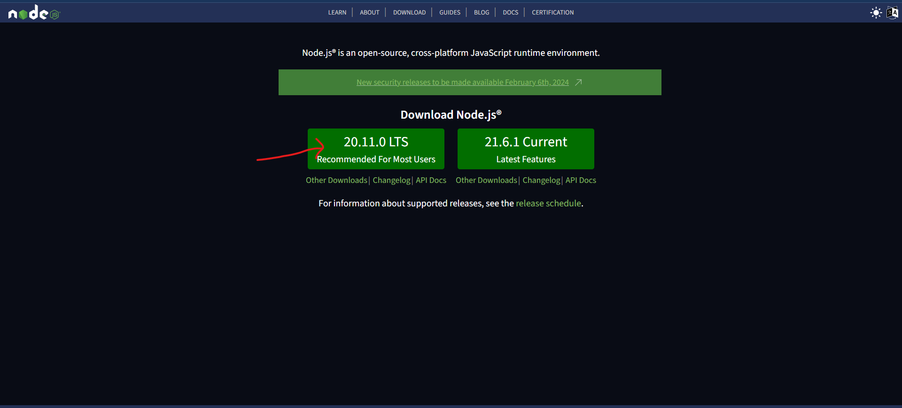

<!-- shields -->

  

  

# MERN Stack Development Environment Setup

  

  

## Table of Contents

  

  

1. [Introduction](#introduction)

  

2. [Prerequisites](#prerequisites)

  

3. [Installation](#installation)

  

- [MERN Stack Development Environment Setup](#mern-stack-development-environment-setup)
  - [Table of Contents](#table-of-contents)
  - [Introduction](#introduction)
  - [Prerequisites](#prerequisites)
  - [Installation](#installation)
    - [Node.js](#nodejs)
    - [Git](#git)
    - [VSCode](#vscode)
    - [VSCode Extensions](#vscode-extensions)
    - [Git Configuration](#git-configuration)
  

4. [Conclusion](#conclusion)

  

  

## Introduction

  

  

Welcome to the Digipodium MERN Stack Development Setup documentation. This guide will walk you through the step-by-step process of setting up your environment for MERN Stack.

  

  

## Prerequisites

  

  

Before you begin, make sure you have the following prerequisites installed:

  

  

- A computer with internet access

  

- Basic familiarity with the command line

  

  

## Installation

  

  

### Node.js

  

  

Node.js is runtime environment for executing JavaScript on server side. It includes npm the package manager for JavaScript packages. It is necessary to develop applications using JavaScript on your system.

  

  

1.  **Download Node.js:**

  

- Visit the [Node.js website](https://nodejs.org/en) and download the LTS version of NodeJS appropriate installer for your operating system.



  

2.  **Install Node.js:**

  

step 1: open the installer and click next


step 2: click on "I accept the terms in the License Agreement" and then click next


step 3: click next


step 4: click next


 step 5: click next __without checking__ the checkbox at this step


 step 6: click "Install" at this step to finalize installation


### Git

Git is a version control system that will help you track changes in your code.

  

  

1.  **Download Git:**

  

- Visit the [Git website](https://git-scm.com/downloads) and download the installer for your operating system.

  

  

2.  **Install Git:**

  

- don't change any setting, keep pressing next and it will be installed.

  

  

### VSCode

  

  

Visual Studio Code (VSCode) is a powerful code editor that provides excellent support for MERN Stack development.

  

  

1.  **Download VSCode:**

  

- Visit the [VSCode website](https://code.visualstudio.com/) and download the installer for your operating system.

  

  

2.  **Install VSCode:**

  

- Follow the installation steps and check all the boxes and click install

  

  

### VSCode Extensions

  

  

Enhance your VSCode experience with the following extensions:

  

  

1.  **Live Server Extension:**

  

- Open VSCode.

  

- Navigate to the Extensions view (`Ctrl + Shift + X`).

  

- Search for "Live Server" and install the extension.

  


  

  

2.  **Auto Rename Tags Extension:**

  

- Open VSCode.

  

- Navigate to the Extensions view (`Ctrl + Shift + X`).

  

- Search for "Auto rename tags" and install the extension.

  


  

  

3.  **Google Fonts Extension:**

- Open VSCode.
- Navigate to the Extensions view (`Ctrl + Shift + X`).
- Search for "Google Fonts" and install the extension.


 4. **JavaScript Snippets Extension:**

- Open VSCode.
- Navigate to the Extensions view (`Ctrl + Shift + X`).
- Search for "es6" and install the "JavaScript (ES6) code snippets" extension.


 5. **React Snippets Extension:**

- Open VSCode.
- Navigate to the Extensions view (`Ctrl + Shift + X`).
- Search for "es7+" and install the "ES7+ React/Redux/React-Native/JS snippets" extension.


 6. **Next.js Snippets Extension:**

- Open VSCode.
- Navigate to the Extensions view (`Ctrl + Shift + X`).
- Search for "nextjs" and install the "Nextjs Snippets" extension.


 6. **VS Code Icons Extension:**

- Open VSCode.
- Navigate to the Extensions view (`Ctrl + Shift + X`).
- Search for "material icon" and install the "Material Icon Theme" extension and set the icon theme when asked.


  

### Git Configuration

  

`(create an account on github.com if you don't have one already)`

  

open your terminal and run the following commands to configure your Git username and email:

  

  

```bash

  

git  config  --global  user.name  "Your Name"

  

git  config  --global  user.email  "your.email@example.com"

  

```

  

  

Replace "Your Name" and "your.email@example.com" with your actual name and email.

## Conclusion

Congratulations! You have successfully set up your MERN Stack Development environment using Node.js, Git, and VSCode. Happy coding!
